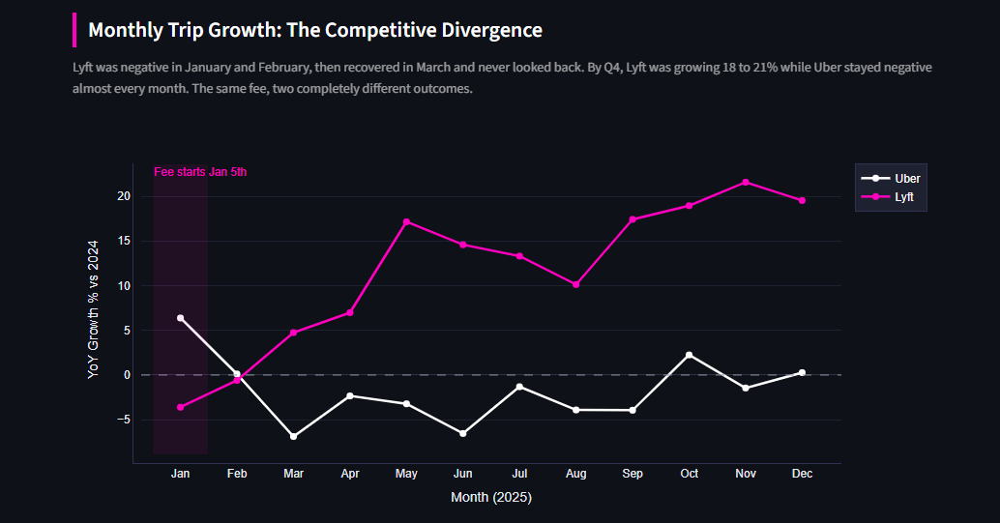

# NYC Congestion Pricing: Uber vs Lyft: Part 3

**Part 3 of 3** in the NYC Congestion Pricing Impact Analysis Series

[Part 1: Quasi-Experimental Analysis](https://github.com/amontaywelch/NYC_Congestion_Quasi_Analysis) | [Part 2: Full Year YoY Analysis](https://github.com/amontaywelch/NYC-Rideshare-Analysis-Part-2) | **Part 3: Uber vs Lyft (this repo)**

[Live Dashboard](https://nyc-rideshare-analysis-part-3-fjsstencltzb5myc4py9z5.streamlit.app/)

---

## Project Overview

Parts 1 and 2 treated Uber and Lyft as a single rideshare market. That was intentional, as the goal was to measure the overall impact of the $1.50 congestion fee on NYC rideshare. But the aggregate numbers were hiding something. When you split the data by company, a completely different story emerges.

This analysis asks one question: did congestion pricing affect Uber and Lyft the same way? The answer is no, and the reasons why tell you a lot about how each platform thinks about its drivers.

---

## The Data

NYC Taxi and Limousine Commission (TLC) High Volume For-Hire Vehicle trip records. Full calendar year 2024 and 2025, covering approximately 400 million records across both years. Processed in Google BigQuery, visualized in Python and Streamlit.

Companies are identified via the `hvfhs_license_num` field. HV0003 is Uber, HV0005 is Lyft. All other operators are excluded.

*Note: The data used in Part 3 is the same as Parts 1 and 2, so there is no instance of the data dictionary in this README.*

---

## Key Findings

**Lyft captured the congestion zone while Uber retreated.**
Uber's Manhattan dropoffs fell 9% year over year. Lyft's grew 10%. That is a 20-point swing in the same market, under the same $1.50 fee, in the same year.

**The two companies made opposite choices about driver pay.**
Uber's Manhattan dropoff revenue grew 7.7% while driver pay fell 4.5%. The platform kept the upside and passed the fee cost to drivers. Lyft's revenue grew just 3.6% but driver pay surged 12.7%. One company optimized for short-term profit. The other optimized for driver supply.

**Uber is becoming a rush hour platform in Manhattan.**
The only time window where Uber grew was 5 to 11AM. Lyft grew across all 24 hours and dominated the 9AM to 5PM daytime economy. Outside of rush hour, Uber is losing the city.

**Uber was negative 6 out of 7 days. Lyft had zero negative days.**
The fee didn't just hurt Uber in the congestion zone. It accelerated a market share erosion that showed up across the entire week and across multiple boroughs.

**The fee's damage to Uber spilled into Brooklyn.**
Brooklyn sits outside the congestion zone boundary, yet Uber lost trips there too. Cross-borough trips that route through the zone likely pushed riders toward Lyft, and Brooklyn absorbed some of that displacement.

**What started as a shared shock became a one-sided story.**
Uber responded well by increasing trips by 6.38% in January, while Lyft dropped by 3.6%. February saw both companies hover near neutral growth, as the fee had time to truly implement itself. **Here's where the numbers shift:** By March, Uber had dropped nearly 7% of their previous year trip volume, while Lyft recovered and saw a 4.75% increase and never looked back. By Q4, Lyft was growing 18 to 21% year over year while Uber remained negative nearly every month.

**Uber actually pays drivers more per mile in the zone.**
Uber's average pay per mile in the congestion zone was $6.43 vs Lyft's $5.59. Yet Uber drivers still avoided it. The issue wasn't absolute pay, it was opportunity cost. Uber drivers had better options outside the zone and took them. Lyft drivers didn't, so zone trips remained worth their time.

---

## The Nuance

Uber is not simply losing. Uber's net revenue grew faster than Lyft's in absolute terms. Cutting driver pay while growing revenue is a legitimate profitability strategy, and Uber is executing it deliberately. The tradeoff is market position. Lyft is buying market share by keeping drivers happy and in the zone. Whether that pays off long term depends on whether driver supply becomes the key competitive moat in a fee-burdened market. Right now, it looks like it is.

---

## Stack

- **BigQuery**: SQL aggregations across 400M+ records
- **Python**: data export and processing
- **Plotly**: all visualizations
- **Streamlit**: interactive dashboard
- **Streamlit Community Cloud**: deployment

---

## Methodology Notes

For 2025, congestion zone trips are identified using `cbd_congestion_fee > 0`, which isolates trips where the MTA Congestion Relief Zone fee was applied below 60th Street in Manhattan. This field does not exist in 2024 data since the fee was not yet in effect. Manhattan borough is used as a broader proxy for zone-adjacent activity in 2024 comparisons.

Manhattan queries are split into separate pickup and dropoff analyses intentionally. Pickups measure rider demand. Dropoffs measure driver supply. Combining them would mask the behavioral differences that turned out to be the most important part of this story.

All year-over-year comparisons use full calendar year 2024 vs full calendar year 2025. Both datasets were cleaned and validated through the Part 1 and Part 2 pipeline, preserving 99.87% or more of original records.

---

## Recommendations

**#For Uber**

**Introduce zone-specific driver incentives during off-peak hours:** The data shows Uber only grew between 6 and 11AM — the rest of the day, drivers are routing around the zone. A targeted per-trip bonus for Manhattan dropoffs outside of rush hour would directly address the supply gap that is costing Uber daytime volume. The bonus does not need to be large. At $1.50 per trip, even a $0.50 driver supplement on off-peak zone trips would likely move the needle on driver willingness to serve the zone.

**Audit Brooklyn pricing transparency:** Uber lost trips in Brooklyn despite it sitting outside the fee boundary. The most likely cause is riders seeing unpredictable fare estimates on cross-borough trips and switching to Lyft. A clear upfront breakdown of when and why the congestion fee applies would reduce fare shock and likely recover some of that volume without changing the underlying pricing.

**Reconsider the driver pay cut in the zone as a long-term strategy:** Net revenue held up in 2025, but market share did not. If Lyft continues gaining zone drivers and riders at the current rate, Uber's revenue advantage will shrink as volume shifts. The margin gain from cutting driver pay in the zone is finite. The market share loss could compound.

**For Lyft**

**Double down on the Bronx:** Lyft grew pickups there by 20.7% while Uber managed 2.1%. That gap suggests strong organic momentum. Targeted driver recruitment and rider promotions in the Bronx could lock in that advantage before Uber responds.

**Investigate Staten Island underperformance:** It is the one borough where Lyft struggled on both pickups and dropoffs while Uber held positive ground. Understanding whether this is a supply problem, a brand awareness problem, or a market structure problem would tell Lyft whether Staten Island is worth investing in or deprioritizing.

**Protect the driver pay advantage as volume scales:** The current strategy is working because drivers trust that Lyft zone trips are worth their time. As trip volume grows, maintaining that pay ratio will require active management. If driver pay growth slows relative to revenue growth, the supply advantage that drove 2025 performance will erode.

**For Policy Makers**

**Monitor driver earnings in the congestion zone by platform:** The data shows one major platform cut driver pay while growing revenue after the fee launched. If that pattern continues or spreads, it could reduce driver supply in the zone over time, making reliable rideshare harder to access for the riders who depend on it most. Publishing quarterly driver earnings benchmarks by zone would create accountability without requiring regulatory intervention.

**Study the Brooklyn spillover:** Rideshare trips declined in a borough that does not pay the congestion fee. If the fee is suppressing demand in adjacent areas, the traffic reduction benefit may be partially offset by increased personal vehicle use in those neighborhoods. That tradeoff deserves a dedicated study before the fee structure is expanded or made permanent.

## Three Part Series

This is the third and final part of a three-part analysis of NYC congestion pricing's impact on rideshare.

- Part 1 used a quasi-experimental before/after design across 120 million trips to measure the immediate behavioral and financial impact of the fee
- Part 2 expanded to a full year YoY comparison across 400 million trips, finding over $1 billion in revenue implications
- Part 3 breaks the market open by company, revealing that the same external shock produced two completely different strategic responses

Each part builds on the last. The full picture only emerges when you read all three together, showing how a seemingly small fee of $1.50 can have such a huge impact on one of the busiest cities on the planet. 
